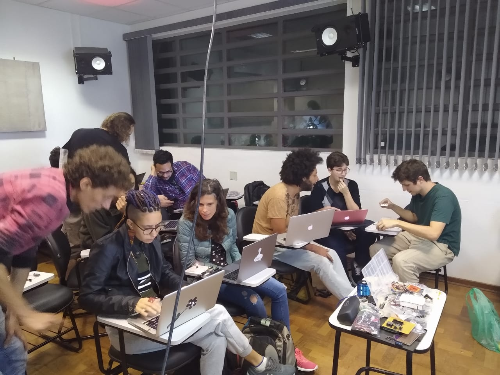
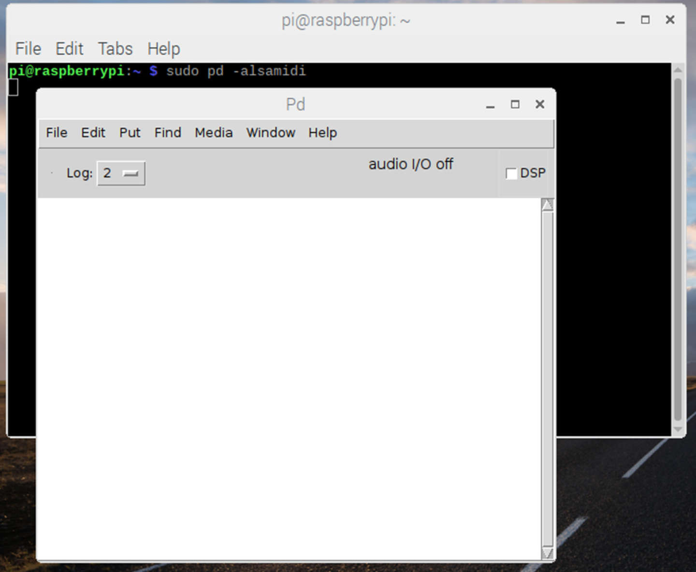
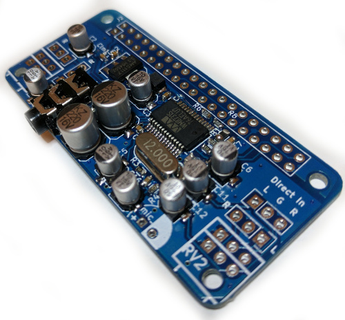

# Grupo de Práticas Interativas do NuSom

## Destaques:

* [Realizada a primeira Oficina de Criação de Instrumentos musicais eletrônicos do GPI](atividades/eventos/oficinas/primeira-oficina-de-criacao-de-instrumentos-musicais-eletronicos.md)

## Atualizações recentes:

* [Tutorial de como compilar o Pd 0.51-4 no Raspberry Pi](atividades/tutoriais/raspberry-pi/compilando-pure-data-vanilla-no-rpi.md)

* [Instalar Interface Audio Injector Zero no Raspberry Pi](atividades/tutoriais/raspberry-pi/placa-de-som-audio-injector.md)







