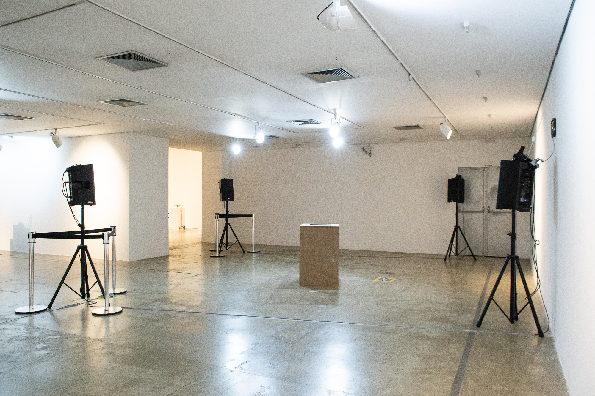

# BUZU \(2019\)

### Autores: Esteban Viveros Astorga \(GPI-NuSom\), Fernando Iazzetta \(NuSom\) e Julián Jaramillo Arango \(GPI-NuSom\).

BUZU é um resultado artístico da colaboração acadêmica entre o grupo NuSom e o projeto InterSCity do Instituto de Matemáticas e Estatística \(IME-USP\) voltado para a Internet do Futuro e as Cidades Inteligentes. Em BUZU é gerada uma imagem acústica do sistema de ônibus da cidade de São Paulo através de dados públicos obtidos das plataformas SPtrans e Olho Vivo.

A obra se localiza no campo da Arte-Ciência e busca levar à esfera pública resultados científicos atingidos em projetos de pesquisa. O trabalho de mapeamento de dados do sistema de transporte e a sua transmutação ao universo sonoro, chamado de sonificação, foi realizado a partir de um conjunto gigante de dados \(data sets\) gerados e processados pelo projeto InterSCity.

O data set coleciona informação sobre o planejamento e comportamento do sistema de transporte através do monitoramento de 2,183 linhas de ônibus durante a semana entre os dias 22 e 28 de Outubro de 2017 na cidade São Paulo. BUZU recria acusticamente o comportamento do sistema durante essa semana.

\_\_

_BUZU foi realizado com recursos da CAPES \(financial code 001\) e do CNPq \(Proc C465446/2014-0\)._

