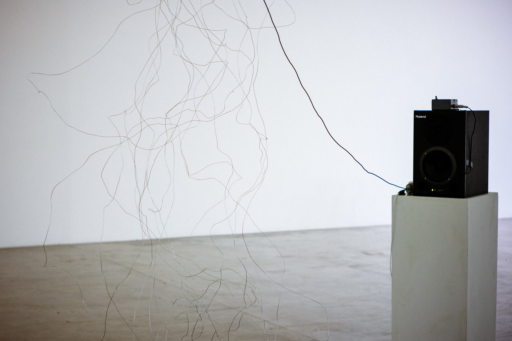

# Constante Elástica \(2018\)

### Autora: Bella

Constante elástica é uma instalação sonora interativa que propõe ao público-visitante uma relação entre o novelo de arame e o corpo. Fazendo uso de dispositivos que captam as vibrações do material metálico, essa interação é traduzida em som.

\[constante elástica é um desdobramento da performance arame, desenvolvida por Chico Lima \(dança\) e Bella \(criação sonora\). A performance é uma ação coreográfica contínua guiada por um longo fio de arame. Esse fio, ao longo do percurso, resulta em um emaranhado, revelando uma sonoridade/eco/ficção sonora.\]

