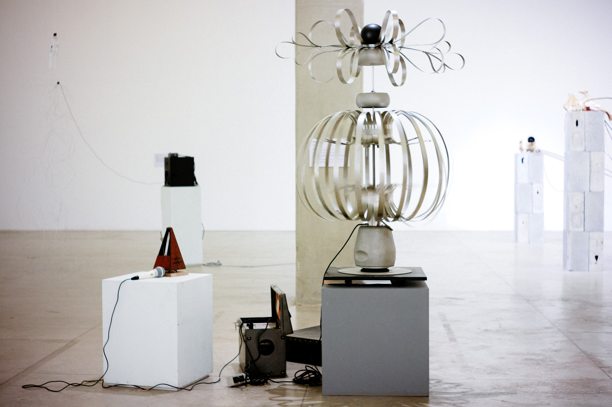

# Objeto estético sensível \(1985\)

### Autor: Roberto Giannecchini

O “Objeto Estético Sensível” e uma obra de intenção artística concebida como escultura móvel e interativa, da qual o observador que a estimula obtém certa resposta. A obra responde a estímulos sonoros tanto do observador que lhe fala, assobia ou bate palmas, mas ela também tentará reagir ou dançar segundo o caráter sonoro do ambiente.

Com a forma de uma laranja de aço deformável, pode se contrair e girar. Ela consiste num mecanismo governado por um motor linear magnético \(voice coil\) que não difere muito de um alto falante comum, apenas sem o cone. Uma parte do movimento linear vertical resulta num giro simultâneo de modo que ambos resultam em movimentos de dança.

O voice coil \(montado na direção vertical\) recebe impulsos elétricos através de um amplificador não-linear de áudio, onde um operador interage via microfone, ou simplesmente é captado o ambiente sonoro. O observador, entrando em contato com a obra, quer interagir com ela... O lúdico e o artístico se confundem e o mistério entre o animado ou não instiga o espectador, que quer ser ator, e assim, brinca. E brincando, cria. GIA 2019.

