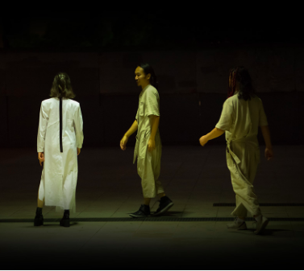

# Abertura e Ativação 1

## **Orquestra Errante**

### _**Performance**_

Ligada ao Núcleo de Pesquisa em Sonologia da USP, a [Orquestra Errante ](http://www2.eca.usp.br/nusom/OE)foi fundada em 2009 pelo professor, compositor e pesquisador Rogério Costa, e é composta de performers dos mais diversos meios e com as mais variadas formações musicais. A prática criativa, coletiva e experimental se desenvolve de forma democrática e não hierarquizada, em um ambiente de diálogo e conversa. A ideia é que qualquer som (instrumentos convencionais e não convencionais) pode ser utilizado em uma criação musical em tempo real.

### Links:

* [http://www2.eca.usp.br/nusom/OE](http://www2.eca.usp.br/nusom/OE)
* [https://soundcloud.com/orquestraerrante](https://soundcloud.com/orquestraerrante)

## **Transduções #7**​ - _Alessandra Bochio e Felipe Merker Castellani_

### _**Performance**_

Performance que se configura enquanto contínuo processo de investigação audiovisual. A condutividade elétrica de meios como a água, os campos eletromagnéticos gerados por câmeras obsoletas e os ruídos de funcionamento de alto-falantes emitindo frequências inaudíveis, tornam-se subsídio para a construção de um percurso improvisatório realizado pelos artistas no momento da performance. Objetos cotidianos também são explorados enquanto fontes sonoras e visuais que passam por diferentes processos de tratamento digital e de distorção analógica em tempo-real.

Um registro audiovisual de trechos da performance podem ser assistidos no seguinte endereço da web:



## **No ravens left for the funeral -**_ ​André Damião_

### _**Performance**_

Performance de guitarra solo, tocada por atuadores eletromagnéticos e circuitos eletrônicos caseiros.

### Links:

* [https://andredamiao.bandcamp.com/](https://andredamiao.bandcamp.com)
* [https://andredamiao.hotglue.me/?concat/](https://andredamiao.hotglue.me/?concat)
* [ http://radia.fm/2019/05/show-737-no-ravens-left-for-the-funeral-by-andre-damiao-for-radio-corax/](http://radia.fm/2019/05/show-737-no-ravens-left-for-the-funeral-by-andre-damiao-for-radio-corax/)

## **Laikabot**​ - _Pocket show banda Laikabot_

### _**Performance**_

Laikabot é uma banda de São Paulo que pode ser classificada como pop, mas também carrega em seu DNA uma mistura quase inconsequente de estilos, ritmos e idiomas; transitando pelo rock, música latina, funk, eletrônica, heavy metal, MPB e outros gêneros.

Formada só por diversão em 2015 por Vivi Lopes (vocal, sintetizador e efeitos), Gil Tokio (bateria e percussão) e Kiki Isoda (baixo/guitarra e sintetizador), estreou no ano seguinte no festival Rock Business, em São Paulo, e, logo de cara, foi eleita campeã, tanto pelo júri oficial como pelo público.

As principais inspirações para as letras e arranjos autorais do grupo vêm de referências visuais e universos fantásticos, como os filmes de Tarantino, de ficção científica, da dança butoh e dos quadrinhos.

Os instrumentos musicais são construídos ou hackeados pela própria banda, reforçando o caráter experimental das composições. Timbres acústicos, elétricos e eletrônicos ganham um visual cibernético por meio de fios e luzes presos aos corpos dos integrantes da Laikabot.

### Links:

* [http://www.laikabot.com.br](http://www.laikabot.com.br)

## **Sonhofonias**​ - _Pedro Paulo Santos_

### _**Performance**_

“Sonhofonias” é uma instalação artístico-científica que tem como objetivo explorar produtos resultantes da atividade do chamado inconsciente humano. Apresenta a "sonificação" ou a transformação em sons de registros Eletroencefalográficos, obtidos ao longo de uma noite de sono, integrada a desenhos e narrações dos textos de Carl Jung que foram criados a partir de sua exploração pessoal e reflexões sobre o conteúdo de seus próprios sonhos.&#x20;

### Links:

* [https://gpi-nusom.gitbook.io/documentacao/atividades/producao/producoes-artisticas/sonhofonias](https://gpi-nusom.gitbook.io/documentacao/atividades/producao/producoes-artisticas/sonhofonias)
