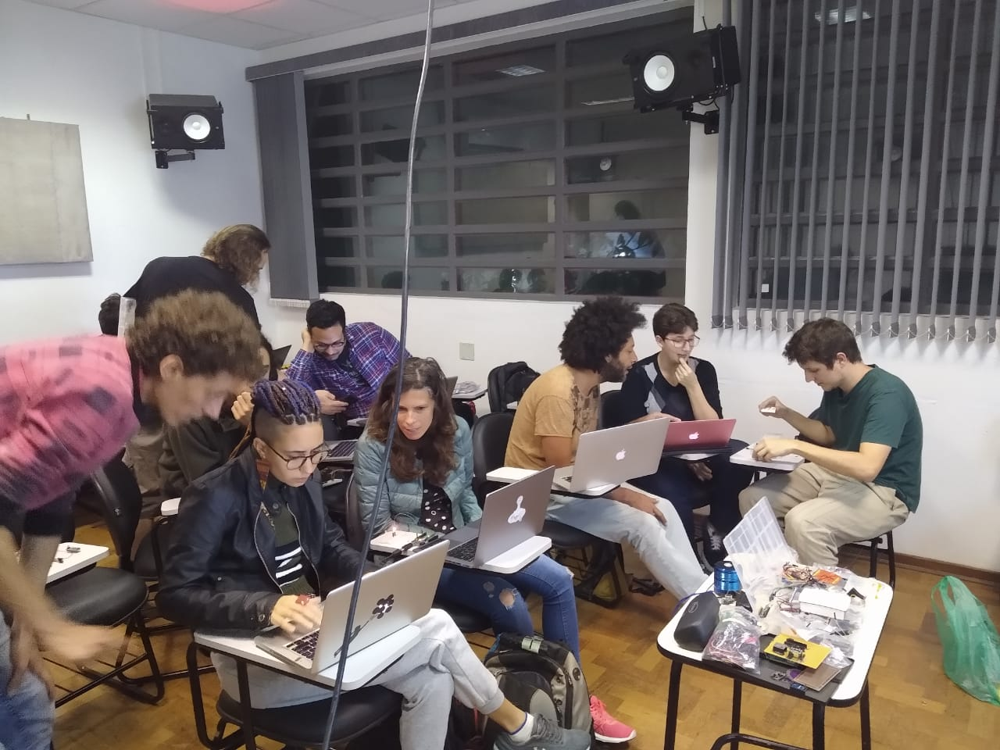

# Primeira Oficina de Criação de Instrumentos musicais eletrônicos

Entre os dias 10 a 12 de dezembro foi realizada a Primeira Oficina de Criação de Instrumentos musicais eletrônicos promovida pelos integrantes do GPI-NuSom.

Com o objetivo de promover um primeiro contato com as tecnologias open hardware e open software, os participantes da oficina puderam criar seus primeiros sketches em Arduino conversar com patches de Pure Data. Muitos sensores e novas possibilidades de expressão musical através dessas tecnologias foram apresentadas. Como facilitadores, Cristiano Figueiró, Esteban Viveros, Guilherme Fiorentini, Fabio Martinele e Vitor Kisil, junto a todos os participantes puderam colocar uns circuitos eletrônicos para cantar.

