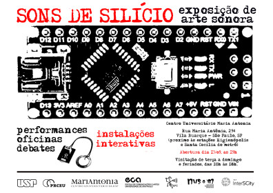

# Segunda edição Sons de Silício

A 16.a edição da série ¿Música? apresenta a exposição Sons de Silício, explorando o campo da Arte Sonora como conceito integrador de práticas nas fronteiras entre música, artes visuais e ciências da computação e como catalisador de novos modos de experimentação sonora com a tecnologia. A exposição surgiu a partir da colaboração do GPI-NuSom \(Grupo de Práticas Interativas do NuSom\) com o projeto [InterSCity](http://interscity.org/) que pesquisa o futuro de cidades inteligentes. Durante três meses o Centro Maria Antonia será o lugar de encontro e reflexão sobre o som em uma perspectiva ampliada e enriquecida com conceitos de outros campos do conhecimento, fazendo com que o instrumento musical se torne máquina,  dispositivo, arranjo, escultura, sistema interativo, estrutura ressonante, meio para explorar a informação, extensão do corpo, circuito, escultura, canal e experimento. Durante a exposição serão realizadas performances e oficinas. 

A série ¿Música? é organizada desde 2005 pelo NuSom, Núcleo de Pesquisas em Sonologia da USP. Os eventos apresentam regularmente trabalhos musicais e de arte sonora que tomam como ponto de discussão e reflexão o experimentalismo, o uso crítico de tecnologias de produção sonora, a integração entre elementos visuais, gestuais e sonoros, o emprego de técnicas de improvisação e a exploração dos espaços de performance

* [Programação](programacao-sons-de-silicio-no-maria-antonia.md)
* [Ficha Técnica](ficha-tecnica.md)

