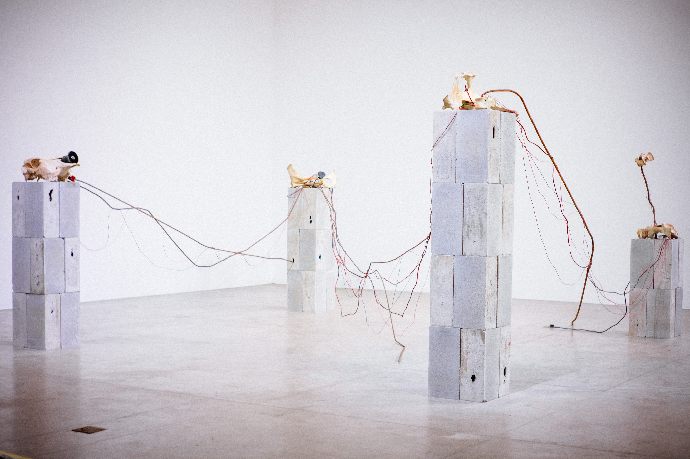

# Móbile de vaca morta com vergalhões de ferro e frases de auto-ajuda narradas por vozes sintetizadas

### Autores: Augusto Piccinini, João Mascaro, Vinícius Fernandes

Um móbile erigido a partir de vergalhões de construção abandonados e correntes. Uma peça central se ramifica em módulos menores sugerindo padrões de crescimento vegetal. Os objetos responsáveis pelo seu equilíbrio, entretanto, são de origem animal, ossos diversos oriundos de uma vaca. Seis alto-falantes são instalados diretamente nos ossos, em posições sugeridas plasticamente pela própria estrutura óssea do animal. Nesse sistema de som será reproduzido simultaneamente, em volume sutil, os álbuns “Vários MIDIs maneiros com timbres mais maneiros ainda intercalados com frases de auto-ajuda narradas por vozes sintetizadas”, “Igual ao álbum anterior mas desta vez mais radical e mais profundo”, “Just like the last two albums but this time in english in order to appeal to international audiences” de Augusto Piccinini \([https://3edgy5u.bandcamp.com/](https://3edgy5u.bandcamp.com/)\).

A instalação opera uma espécie de ressurreição teratogênica pela reconstituição de um animal-edifício a partir de resíduos biológicos e arquitetônicos. Estrutura precária e moribunda que forma um oximoro irônico com o material sonoro, constituído pela saturação semiótica do universo kitsch de uma seara de produção literária e musical obstinada com a obliteração da angústia existencial fundamental da experiência humana, a consciência prematura da finitude do sujeito.

