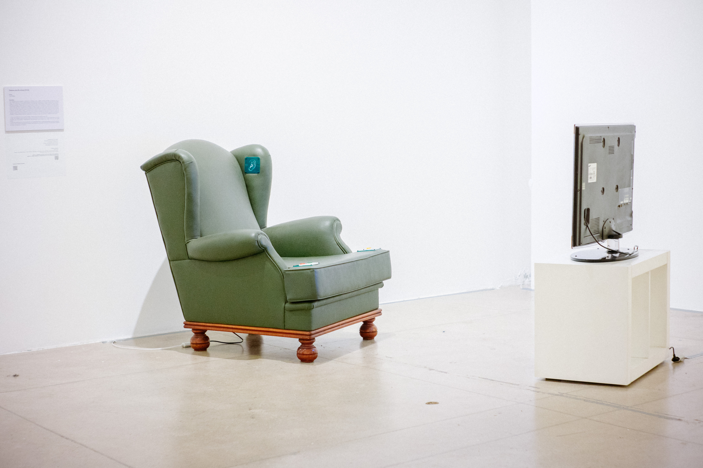

# Telefone sem fio Interativo \(2018\)

### Concepção: Tide Borges

### Criação: Tide Borges e Shiyozi Izuno

### Programação: Esteban Viveros

#### TELEFONE SEM FIO vídeo, 1976 

**Criação:** Anna Bella Geiger, Leticia Parente, Fernando Cocchiarale, Ivens Machado, Letícia Parente, Miriam Danowski,Paulo Herkenhoff e Sonia Andrade

**Câmera:** Davi Geide

Telefone sem fio é uma  instalação que consiste em um vídeo, TELEFONE SEM FIO \(1976\), e uma poltrona interativa que remonta a brincadeira popular, infantil, jogada no Brasil e ao redor do mundo, que consiste em brincar com a sonoridade das palavras.

Através do vídeo, percebemos que apesar de todas as questões levantadas no tocante à conjuntura política do Brasil de 1976, como a censura à liberdade de expressão e o papel da televisão, existem proposições poéticas associadas à escuta e à voz que nos interessam relacionar com a produção de poesia sonora brasileira contemporânea.

## 

**POESIA SONORA CRIADA POR FLORA HOLDERBAUM E TIDE BORGES**



## 

**VÍDEO SOBRE A CONSTRUÇÃO DA POLTRONA**



