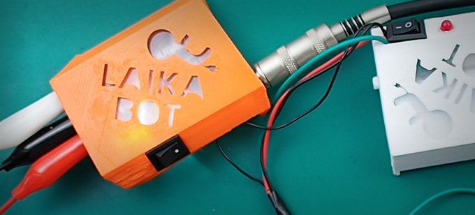
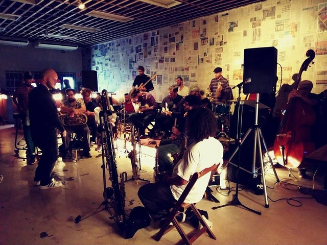

# Ativação 2

## **Theremino** _- Laikabot_

### _Oficina_

Theremin de arduino. Nesta oficina os participantes terão a oportunidade de construir um theremin digital utilizando um Arduino, desde a preparação do sintetizador sonoro até o desenvolvimento de interfaces entre instrumento e pessoa.

## **HackLab GPI**_- GPI/NuSom_

### _Laboratório aberto_ 

Laboratório aberto de criação de pedais de processamento com Raspberry Pi.

### Links:

* [https://gpi-nusom.gitbook.io/documentacao/atividades/tutoriais/raspberry-pi](https://gpi-nusom.gitbook.io/documentacao/atividades/tutoriais/raspberry-pi)
* [https://gpi-nusom.gitbook.io/documentacao/atividades/producao](https://gpi-nusom.gitbook.io/documentacao/atividades/producao)

## **SPIO Orquestra**​

### Performance

A SPIO \(São Paulo Improvisadores em Orquestra\) é a uma orquestra de músicos e artistas sonoros das mais diversas trajetórias que trabalham a linguagem da improvisação musical livre através da regência.

Com sonoridade ímpar e formação bem fora do comum , a SPIO tem em seu corpo sonoro instrumentos que vão dos tradicionais em orquestras até aparatos eletrônicos e luthierias de invenção. A proposta se desenvolve em uma abordagem experimental, sempre com peças compostas instantaneamente, o que faz com que cada apresentação se mostre única.

### Links:

\_\_[_https://www.facebook.com/spioorquestra/_](https://www.facebook.com/spioorquestra/)\_\_

