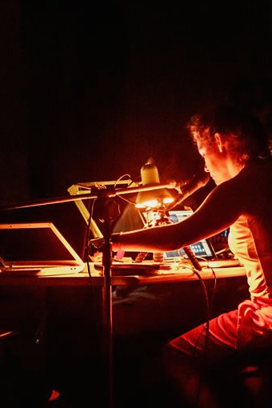

# Ativação 3

## **Veia**​ - _Inés Terra_

### _Performance_

Fluxos sanguíneos, caminhos sinuosos do corpo vocal.



## **\#afetos\_ao\_vento**​. - _Marina Mapurunga_

### _Performance Audiovisual_

### Links:

* [http://mapu.art.br/performances-audiovisuais/](http://mapu.art.br/performances-audiovisuais/)

## **Batata Musik -** ​_Pedro Nonino_

### _Performance/instalação_

Plataforma de síntese interativa aonde vegetais, sensores de luz e outros controladores são utilizados como partes de um sintetizador analógico, que então tem seu som coletado por um computador que processa o som e o projeta em forma de espectrograma em diversos objetos e espelhos.

