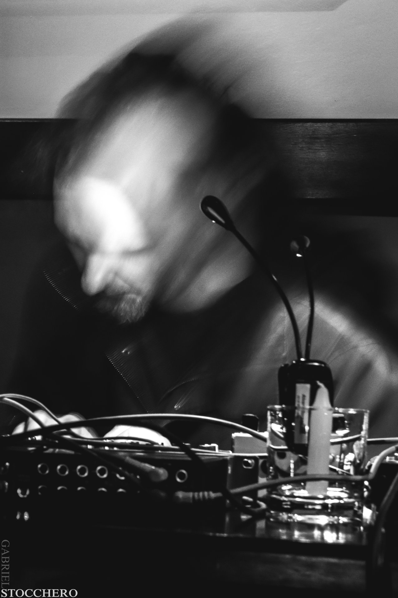

# Ativação 6

## **Luteria Digital Experimental com a biblioteca ELSE para Pure Data -** ​_Alexandre Torres Porres_

### _Oficina_

### Links:

* [https://alexandre-torres.wixsite.com/el-locus-solus](https://alexandre-torres.wixsite.com/el-locus-solus)
* [https://puredata.info/author/porres](https://puredata.info/author/porres)
* [https://github.com/porres](https://github.com/porres)

## **Sample Flipping: criação musical transformando arquivos de áudio -** ​Henrique Rocha de Souza Lima

### _Oficina_

Oficina prática dedicada a realizar gravações de áudio e processá-las para gerar materiais musicais que serão utilizados para iniciar uma peça musical. Sempre com a mão na massa, ao longo da interação com um sampler, o público participante é convidado a praticar uma escuta analítica em contexto de experimentação, organizar um material musical, e começar a desenvolver uma peça musical conforme suas orientações estéticas, sempre atento às configurações estruturais dos samples trabalhados.

### Links:

* [https://usp-br.academia.edu/Henrique\_lima](https://usp-br.academia.edu/Henrique_lima)
* [http://escutaipatinga.eco.br/](http://escutaipatinga.eco.br/)
* [https://henriqueinfo.tumblr.com/home](https://henriqueinfo.tumblr.com/home)

## **Emaranhado Corpossom -** ​_Francisco Lauridsen Ribeiro_

### _Performance_

'emaranhado corpossom', é uma ação em duas partes: \(1\) uma ativação sonora do espaço arquitetônico expositivo da Maria Antônia por parte do coletivo e \(2\) uma ação minha baseada na carta de 1947 de Antonin Artaud 'o homem árvore', valendo-se do mesmo campo de procedimentos, a saber: a movimentação livre pelo espaço, a vocalização de sensações, e a efetuação de um roteiro dramatúrgico-sonoro.

