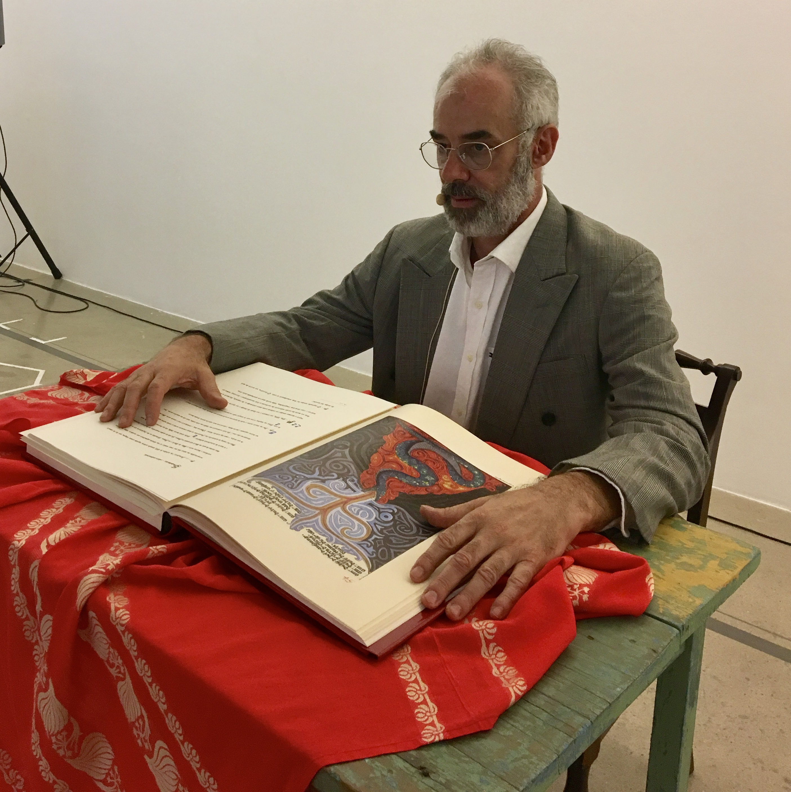

# Encerramento e ativação 7

## **Patch Shop Boy**​ - _Alexandre Torres Porres_

### _Perfomance_

### Links:

* [https://alexandre-torres.wixsite.com/el-locus-solus](https://alexandre-torres.wixsite.com/el-locus-solus)
* [https://puredata.info/author/porres](https://puredata.info/author/porres)
* [https://github.com/porres](https://github.com/porres)

## **Sonhofonias**​ - _Pedro Paulo Santos_

### _Performance_

“Sonhofonias” é uma instalação artístico-científica que tem como objetivo explorar produtos resultantes da atividade do chamado inconsciente humano. Apresenta a "sonificação" ou a transformação em sons de registros Eletroencefalográficos, obtidos ao longo de uma noite de sono, integrada a desenhos e narrações dos textos de Carl Jung que foram criados a partir de sua exploração pessoal e reflexões sobre o conteúdo de seus próprios sonhos. 

### Links:

* [https://gpi-nusom.gitbook.io/documentacao/atividades/producao/producoes-artisticas/sonhofonias](https://gpi-nusom.gitbook.io/documentacao/atividades/producao/producoes-artisticas/sonhofonias)

## **Constante Elástica**​ - _Bella_

### _Performance_

A instalação constante elástica é um desdobramento da performance Arame de Chico Lima. A proposta é que ele execute a performance, que consiste num movimento que se desdobra no espaço a partir do contato/relação com o arame. As marcas produzidas no arame pelo seu movimento irão reger/fazer parte da instalação.

## **Nylon bites**​ - _Mariana Carvalho_

### _Performance_

Performance interativa com formação de duos entre o público e a artista mordendo nylon. Serão usados microfones binaurais e estarão conectadxs à mesa de som. Uma terceira pessoa pode escutar com fone direto da mesa e "mixar as cabeças".

## **Ensemble Anagrama**

### _Performance_

A partir do "Pas de Cinq", de Maurice Kagel, a performance desenvolverá a exploração sonora do ambiente, enquanto espacialidade e acústica, criando correspondências entre gesto e musicalidade incidental/intencional, desde a delimitação e instalação das linhas do percurso, um pentágono com uma estrela de cinco pontas no seu interior, preenchidas com diversos materiais, criando semelhanças, contrastes e silêncios. Assim, o grupo criará coletivamente, depois deslocando-se no seu interior, com a percussão dos passos, uma experiência do som, dilatando as fronteiras do musical e os ritmos e ruídos da vida, a técnica e a arte.

Interpretação da peça "Cidades", de Gilberto Mendes em diálogo com a exposição, em sua proposta ao Anagrama de vivência do ruído em que se constroem e desconstroem significados da vida urbana, criando poeticidade e humor do non-sense das sincronias, rupturas e desencontros. Na aleatoriedade dos espaços abertos de um roteiro gráfico que pressupõe música em silêncios e gestos, referências musicais populares e clássicas, uma mixórdia de sons, acústicos e eletrônicos, falados e cantados, definidos e indefinidos, justapostos, sobrepostos, organizados e em caos criam uma miríade de ideias e ressignificações sobre o cotidiano das cidades. As projeções de imagens compõem também os ritmos da peça, agregando mais um aspecto sensorial às imbricações entre música, cinema e artes cênicas.

## **Captador** ​- _Cristiano Figueiró_

Performance com a instalação “Captador” da exposição. 

## Sons de Silício

### Performance

O GPI NuSom se une ao artista multimídia Fernão Ciampa na performance Sons de Silício apresentando o resultado das pesquisas em Luteria digital, Instalações interativas e criação de novas interfaces sonoras.

