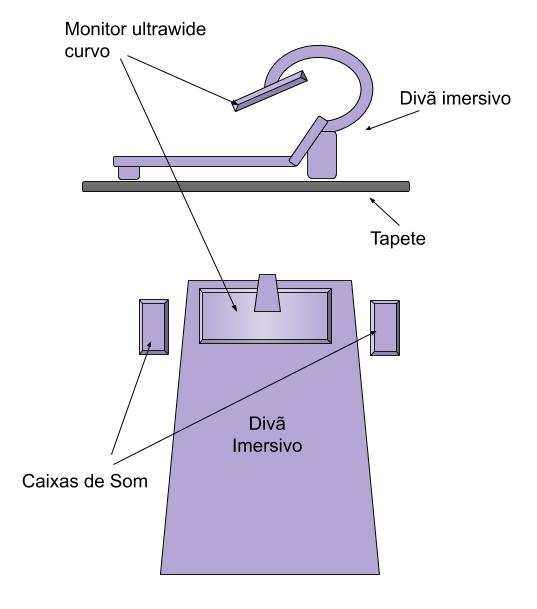

# Sinfonia Onírica, virtualidades suspensas


## PROJETO PARA A OBRA


## Descrição

Sinfonia onírica, virtualidades suspensas” é uma instalação artístico-científica que tem como objetivo explorar produtos resultantes da atividade do chamado inconsciente humano.

Apresenta a sonificação de registros Eletroencefalográficos, obtidos ao longo de uma noite de sono, integrada a desenhos e narrações dos textos de Carl Jung que foram criados a partir de sua exploração pessoal e reflexões sobre o conteúdo de seus próprios sonhos.

Os textos, também sonificados, e as imagens emergidas durante o percurso interior do cientista em sua busca de significação, serão processados e projetados suspensos sobre um sofá imersivo para o expectador se deitar e assistir.

A mescla de todos esses suportes interpretativos inter-relacionados compõem uma obra-passaporte de comunicação entre o consciente e o inconsciente

## Ilustração

