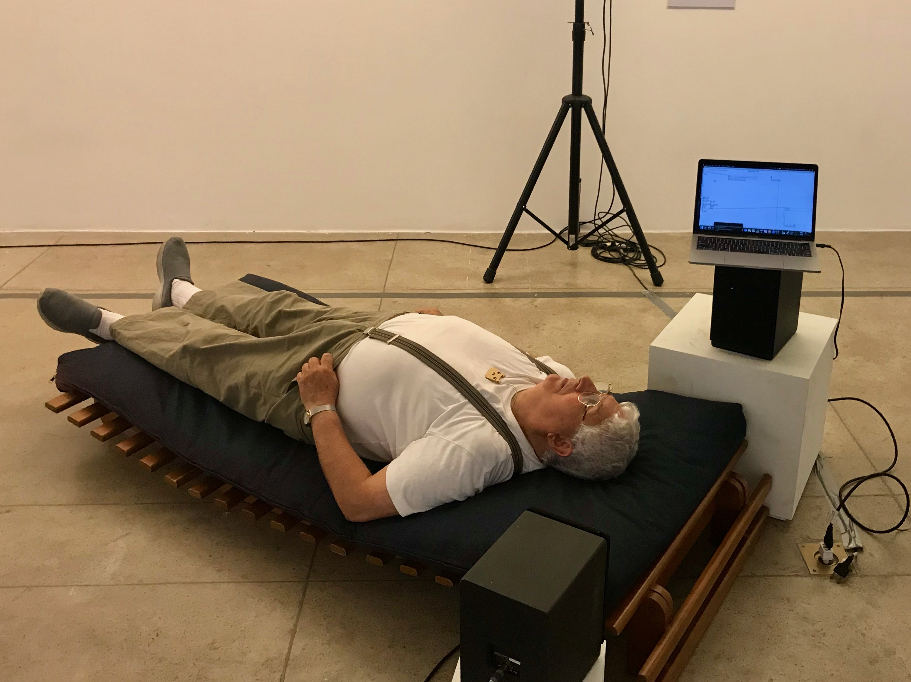

# Sonhofonias \(2018/19\)

## **Descrição**

“Sonhofonias” é uma instalação artístico-científica que tem como objetivo explorar produtos resultantes da atividade do chamado inconsciente humano. Apresenta a "sonificação" ou a transformação em sons de registros Eletroencefalográficos, obtidos ao longo de uma noite de sono, integrada a desenhos e narrações dos textos de Carl Jung que foram criados a partir de sua exploração pessoal e reflexões sobre o conteúdo de seus próprios sonhos. Os textos, também sonificados, e as imagens emergidas durante o percurso interior do cientista em sua busca de significação, constam na tradução para o português de "O LIvro Vermelho" \(2009\) e serão expostos juntamente com a instalação no espaço expositivo. A mescla de todos esses suportes interpretativos inter-relacionados compõem uma obra-passaporte de comunicação entre o consciente e o inconsciente.

## Video



## Imagens

