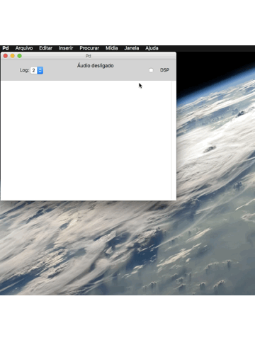

# Instalar Externals no Pd

Para instalar externals no Pd basta acessar na barra de menu: _Ajuda -&gt; Procurar por externals_ e digitar a biblioteca que deseja instalar. Clicando na biblioteca desejada será iniciado o processo de instalação.

Repare que o 

