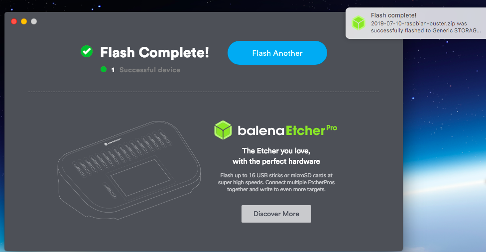

# Instalando Raspbian em um cartão microSD

**Material necessário**

* Computador com sistema operacional \(Linux, Windows ou OSx\)
* Raspberry Pi \(qualquer versão\)
* Cartão microSD \(recomendado 16Gb ou 32Gb\)

**Download do Raspbian**

Existem três opções disponíveis para download do Raspbian, elas são:

* Raspbian Buster with desktop and recommended software
* Raspbian Buster with desktop
* Raspbian Buster Lite

As duas primeiras opções possuem interface gráfica e estão prontas para uso, sendo que a primeira contém uma coletânea de softwares instalados por padrão.

A terceira opção se trata de uma versão do Raspbian sem interface gráfica. Todas as operações são executadas através de linha de comando. É muito útil para projetos onde toda a capacidade de processamento do Raspberry deve ser utilizada na aplicação desenhada.

Neste tutorial faremos uso da segunda imagem, o Raspbian Buster with desktop.

**PASSO 1** - Baixe a versão desejada do Raspbian no site oficial:



**PASSO 2** - Baixe o software Balena Etcher para seu sistema operacional:



**PASSO 3** - Uma vez baixado o balenaEtcher, instale ele na sua máquina.

**PASSO 4** - Insira o SDcard no seu computador e abra o balenaEtcher:

**PASSO 5** - Arraste a Imagem do Raspbian que você baixou no PASSO 2 para dentro da janela do balenaEtcher, se necessário, selecione o cartão SD correto em "Select target e em seguida pressione o "Flash!":

**PASSO 6** - Aguarde o balenaEtcher anunciar o término da operação, insira o cartão microSD no RaspberryPi.

**PASSO 7** -  Conecte a alimentação de energia do seu Raspberry Pi e aguarde o fim da inicialização.

